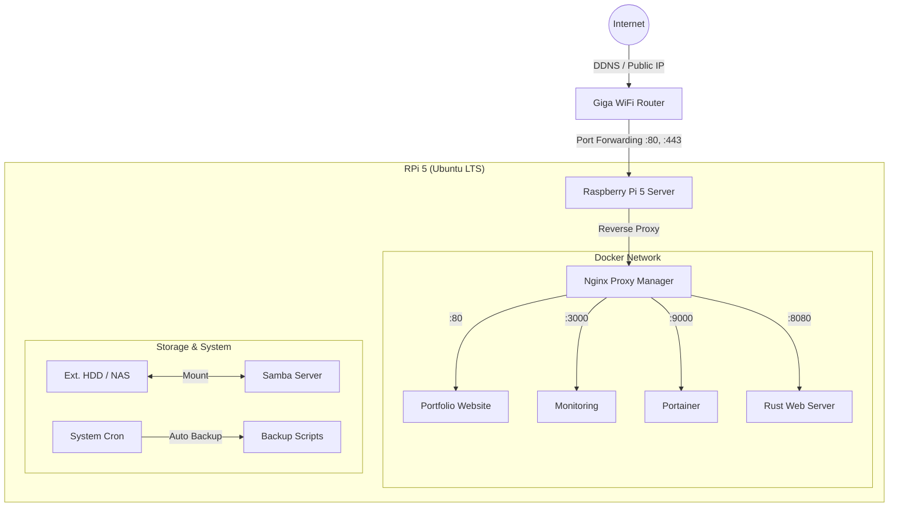

# Pie-in-the-Sky
AWS 청구서가 무서워 직접 구운 홈서버 🥧 | 뜬구름(Pie) 잡는 꿈을 현실(Pi)로.


> **Project Goal:** > 라즈베리 파이 5와 Ubuntu Server LTS를 활용하여 고성능 홈랩(HomeLab) 환경을 구축한 기록입니다.  
> 개인 포트폴리오 웹사이트 호스팅 및 Rust/C++ 개발 환경, 데이터 백업 서버로 운영 중입니다.

---

## 🏗️ Architecture & Network
홈서버의 네트워크 토폴로지 및 서비스 구성도입니다. 보안을 위해 모든 서비스는 Docker Container로 격리되어 있으며, Nginx Reverse Proxy를 통해서만 외부와 통신합니다.



## 🖥️ Hardware Specification
| Component | Details | Note |
| :--- | :--- | :--- |
| **Model** | Raspberry Pi 5 (8GB RAM) | Active Cooler 장착 |
| **Storage (Main)** | NVMe SSD 512GB | PCIe Hat을 통한 고속 부팅/I/O |
| **Storage (Data)** | External HDD 2TB | 데이터 백업 및 NAS 용도 |
| **Network** | Gigabit Ethernet | 고정 IP (Static IP) 할당 |

## 🛠️ Software Stack
* **OS:** Ubuntu Server 24.04 LTS (ARM64) - *안정성과 범용성을 위해 Debian 대신 선택*
* **Container Runtime:** Docker Engine & Docker Compose
* **Proxy & SSL:** Nginx Proxy Manager (Let's Encrypt SSL 자동화)
* **Database:** PostgreSQL, Redis
* **Monitoring:** Prometheus, Grafana

---

## 📂 Directory Structure
이 리포지토리는 **Infrastructure as Code (IaC)** 철학에 따라, 서버의 모든 설정을 코드로 관리합니다.

```bash
.
├── configs/             # 어플리케이션별 설정 파일 (Nginx, Prometheus 등)
├── docker/              # Docker Compose 파일 모음 (서비스별 분리)
│   ├── infrastructure/  # Portainer, NPM 등 핵심 인프라
│   ├── monitoring/      # Grafana, Prometheus
│   └── web-services/    # 포트폴리오, 개인 프로젝트
├── docs/                # 📚 설치 및 운영 가이드 (Troubleshooting 포함)
│   ├── 01-os-setup.md   # Ubuntu 설치 및 초기 보안 설정
│   ├── 02-network.md    # Netplan 고정 IP 및 방화벽(UFW) 설정
│   └── 03-storage.md    # NVMe/HDD 마운트 및 fstab 설정
├── scripts/             # 운영 자동화 쉘 스크립트
└── .gitignore           # 민감 정보(.env, keys) 제외 설정
```

## 🚀 Installation & Setup
서버를 처음부터 구축하거나 재설치(Disaster Recovery)할 때의 절차입니다. 상세 내용은 `docs/` 폴더를 참조하세요.

### 1. Prerequisites
* Ubuntu Server LTS가 설치된 Raspberry Pi 5
* SSH 접속이 가능한 환경 (SSH Key 기반 인증 권장)

### 2. Network Configuration (Netplan)
Ubuntu Server는 `Netplan`을 사용합니다. `/etc/netplan/50-cloud-init.yaml` 설정 예시:
> [📄 Docs: 네트워크 고정 IP 설정 가이드 바로가기](./docs/02-network.md)

### 3. Deploy Services
서비스는 도커 컴포즈로 배포합니다.

```bash
# 1. 레포지토리 클론
git clone [https://github.com/username/my-rpi5-homeserver.git](https://github.com/username/my-rpi5-homeserver.git)
cd my-rpi5-homeserver

# 2. 환경 변수 설정 (보안상 .env는 별도 생성 필요)
cp docker/.env.example docker/.env
vi docker/.env

# 3. 서비스 실행
cd docker/infrastructure
docker compose up -d
```

---

## 🔒 Security Measures
본 서버는 다음과 같은 보안 조치가 적용되어 있습니다.
* **Firewall:** `UFW`를 사용하여 22(SSH), 80, 443 포트 외 모든 인바운드 차단.
* **SSH Hardening:** Password 로그인 비활성화, SSH Key 전용 접속, Root 로그인 차단.
* **Isolation:** 모든 애플리케이션은 Docker Network 내부에서만 통신하며, 외부는 Reverse Proxy를 통해서만 접근 가능.

## 📝 Troubleshooting Log
구축 과정에서 발생했던 문제와 해결 방법을 기록하여 지식 베이스로 활용 중입니다.
* [Issue #1: 라즈베리 파이 5 NVMe 부팅 순서 문제 해결](./docs/issues/01-nvme-boot.md)
* [Issue #2: Ubuntu Netplan 설정 시 Gateway 도달 불가 현상](./docs/issues/02-netplan-gateway.md)

---

## 📧 Contact
* **Name:** [본인 영문 이름]
* **Email:** [본인 이메일]
* **Tech Blog:** [블로그 주소]
